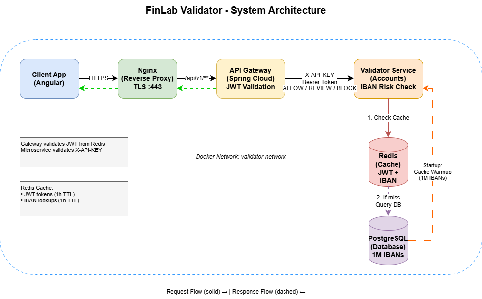

# FinLab Validator

A microservices-based IBAN validation system with JWT authentication, Redis caching, and JMeter stress testing capabilities.

## Architecture



The system consists of the following components:

- **Frontend**: Angular with Nginx
- **API Gateway**: Spring Cloud Gateway
- **Validator Service**: Spring Boot microservice
- **Database**: PostgreSQL
- **Cache**: Redis
- **Testing**: JMeter

**Request Flow:**
1. Client App → Nginx (HTTPS :443)
2. Nginx → API Gateway (/api/v1/**)
3. Gateway validates JWT (from Redis) → Validator Service (X-API-KEY)
4. Validator checks Redis cache first
5. If cache miss, queries PostgreSQL
6. Returns ALLOW/REVIEW/BLOCK decision

## Prerequisites

- Docker

## How to Run

Navigate to the `infra` directory and start all services:

```bash
cd infra
docker compose up --build -d
```

The application will be available at:
- Frontend: https://localhost

## Default Login

Use any username to login (e.g., `testuser`, `jmeter-user`, etc.)

## Stress Testing

Two JMeter stress test scenarios are available: normal load and extreme load.

### Prerequisites for Stress Tests

You need a valid IBAN. To get one, query the database or Redis.
Redis and Database ports are intentionally exposed.

### Running Normal Load Test

50 threads, 10 loops each (500 total requests):

```bash
docker exec validator-jmeter sh -c "jmeter -n -t /tests/normal-load.jmx \
  -Jgateway.host=finlab-client \
  -Jgateway.port=443 \
  -Japi.key=finlab-validator-api-key \
  -Jauth.username=jmeter-user \
  -Jtest.iban=<VALID_IBAN> \
  -l /results/normal-load-\$(date +%Y%m%d-%H%M%S)-results.jtl \
  -j /results/normal-load-\$(date +%Y%m%d-%H%M%S).log"
```

**PowerShell Alternative:** Use `stress_tests/run-normal-load.ps1` (replace `<VALID_IBAN>` with your IBAN)

### Running Extreme Load Test

500 threads, 50 loops each (25,000 total requests):

```bash
docker exec validator-jmeter sh -c "jmeter -n -t /tests/extreme-load.jmx \
  -Jgateway.host=finlab-client \
  -Jgateway.port=443 \
  -Japi.key=finlab-validator-api-key \
  -Jauth.username=jmeter-user \
  -Jtest.iban=<VALID_IBAN> \
  -l /results/extreme-load-\$(date +%Y%m%d-%H%M%S)-results.jtl \
  -j /results/extreme-load-\$(date +%Y%m%d-%H%M%S).log"
```

**PowerShell Alternative:** Use `stress_tests/run-extreme-load.ps1` (replace `<VALID_IBAN>` with your IBAN)

### Viewing Test Results

After running the tests, view the results in the web UI:
1. Login at https://localhost
2. Navigate to "Test Results" page
3. Results are displayed with timestamps and detailed metrics

## Features

- Stateful JWT authentication with Redis
- IBAN validation using JDBC/JdbcTemplate
- 1,000,000 valid Bulgarian IBANs pre-generated in database
- Redis cache with automatic warmup (1M max entries, 60min TTL for production)
- Real-time stress test result visualization
- Response time metrics (average, min, max, P90, P95)
- Error rate tracking

## Documentation

- [Architecture Diagram](docs/architecture.drawio) - System architecture and request flow
- [Cache Configuration](docs/CACHE.md) - Redis cache setup, warmup, and monitoring
